# Dangani 🎓🤝
**Task Helper for Students**

Dangani adalah platform *peer-to-peer task delegation* yang dirancang khusus untuk mahasiswa yang mengalami kesulitan. Aplikasi ini menghubungkan mahasiswa yang membutuhkan bantuan ("Requester") dengan mahasiswa lain yang ingin mencari penghasilan tambahan ("Helper") dengan sistem task point yang terinspirasi dari story point pada metodologi scrum.

---

## 📸 Screenshots

<div align="center">
  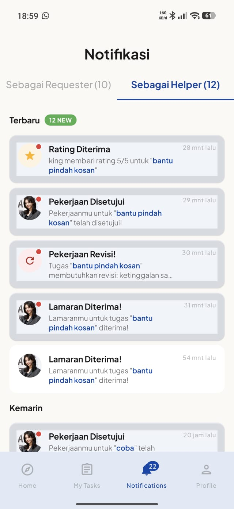
  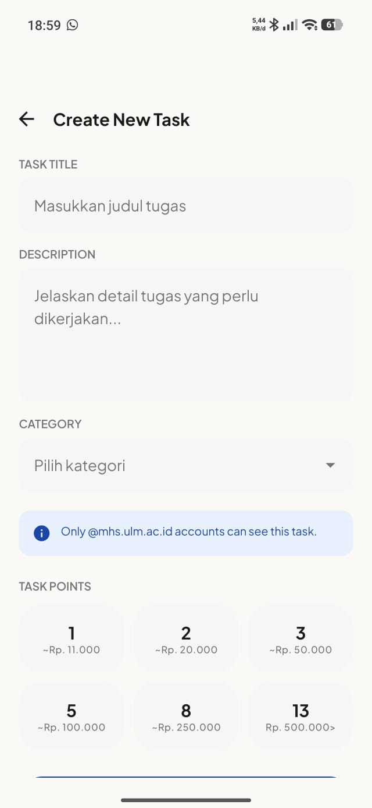
  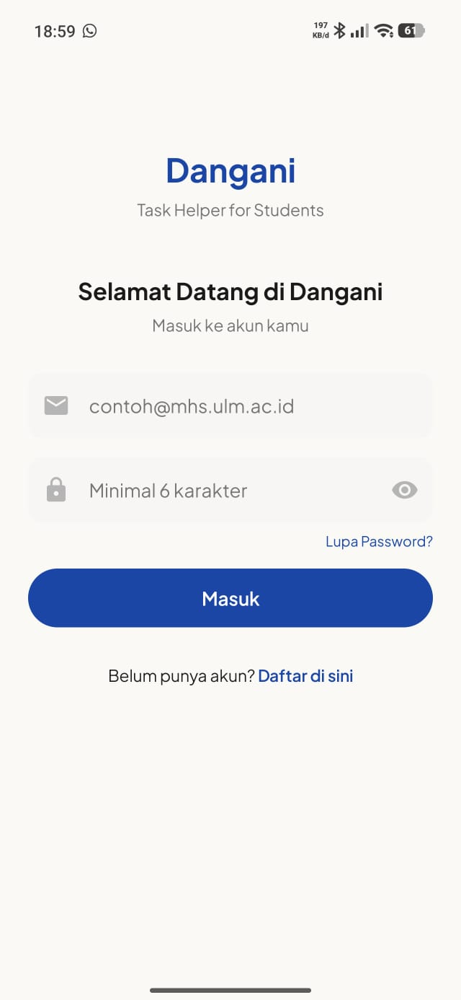
  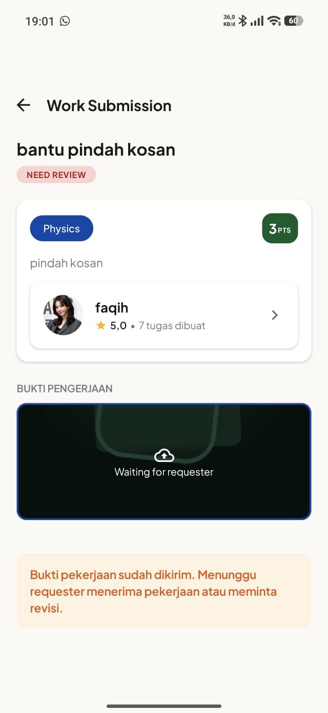
  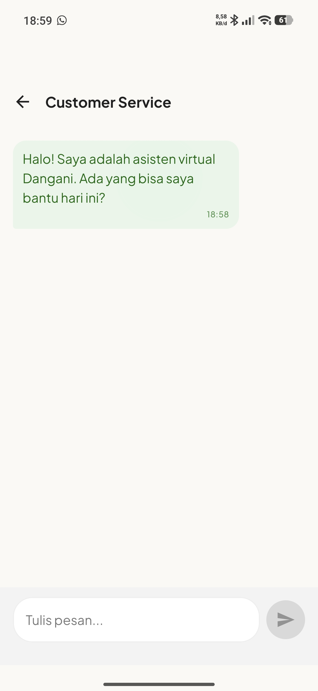
  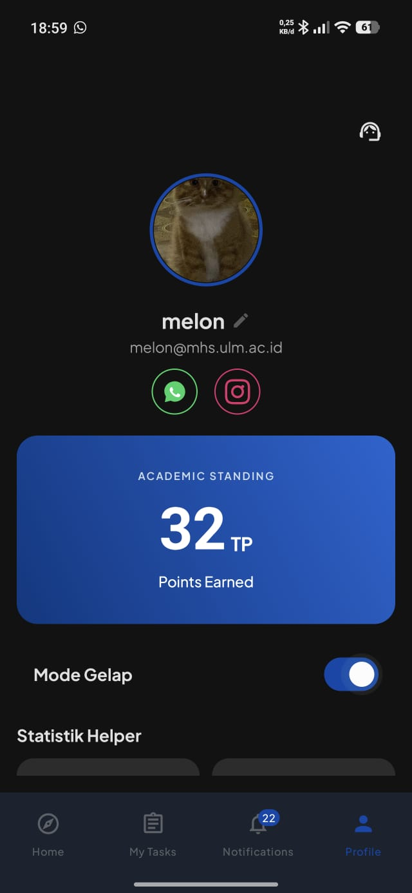
  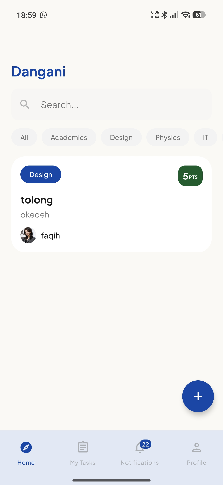
  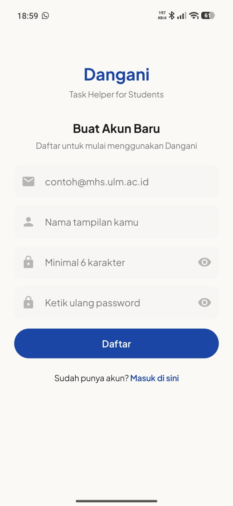
  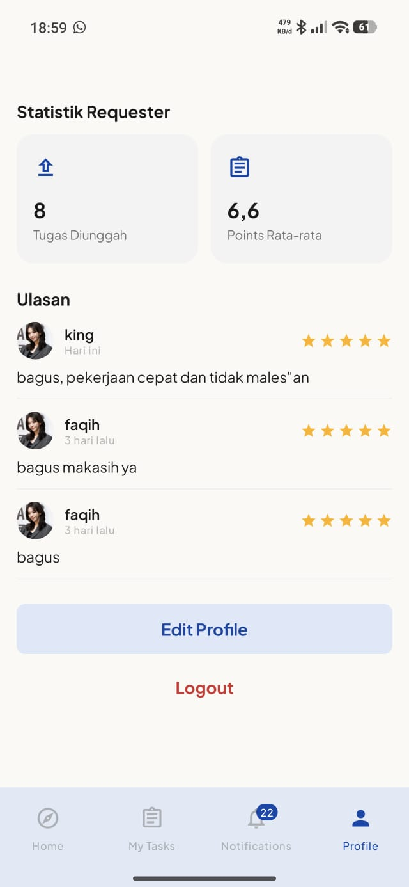
  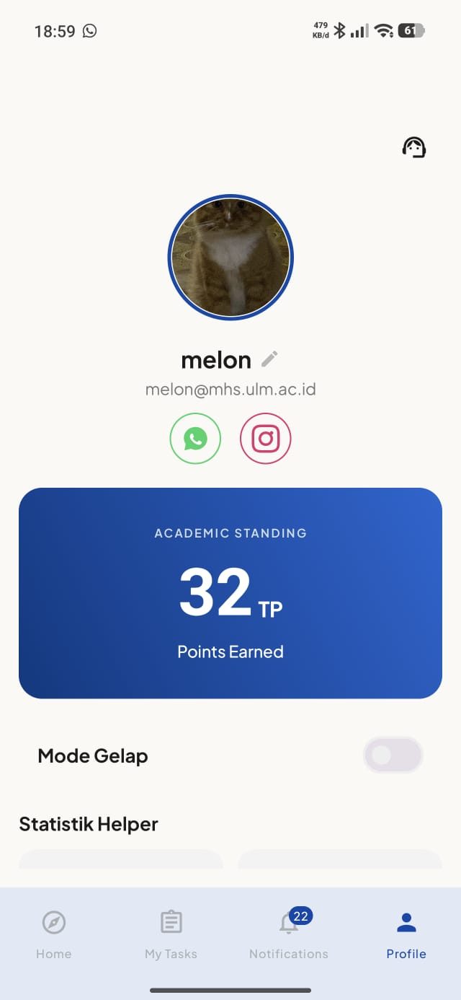
  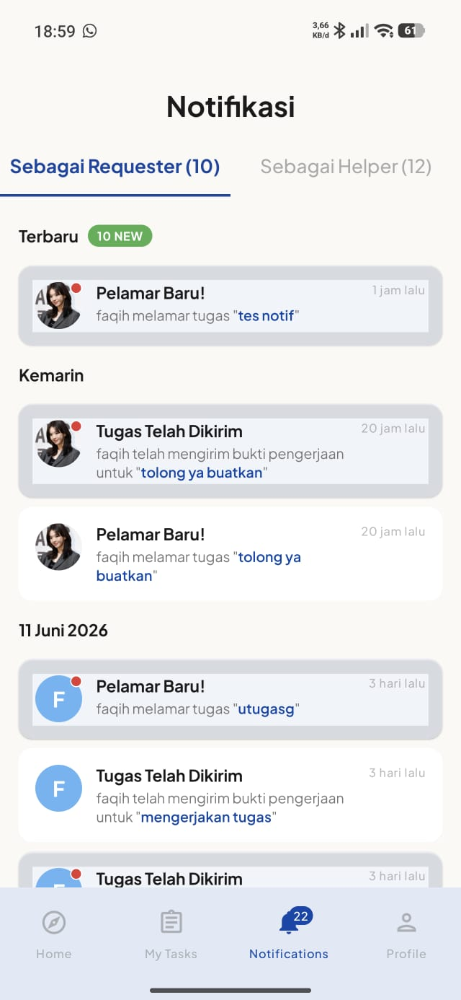
  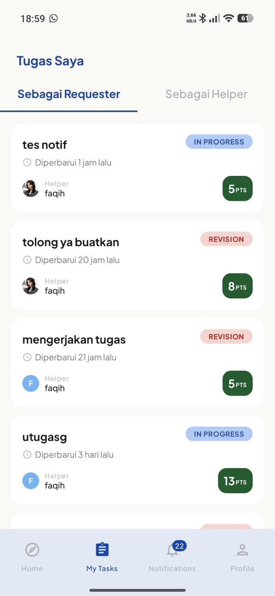
  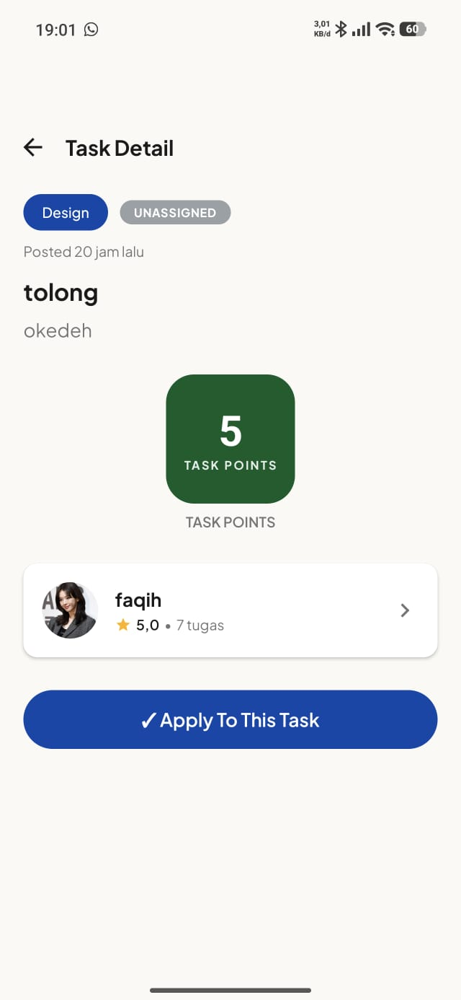
  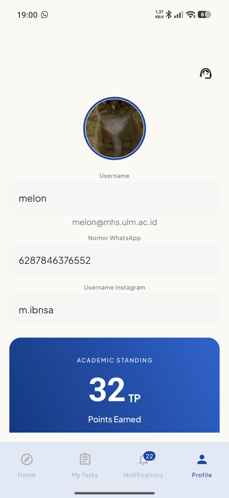
  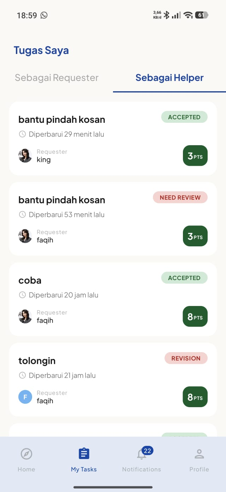
</div>

---

## 🌟 Fitur Utama Aplikasi

### 1. Pembuatan Tugas (Task Creation)
Requester dapat membuat tugas baru dengan mudah. Mereka bisa menentukan judul, deskripsi rinci, tenggat waktu (deadline), dan kategori tugas (misal: Makalah, Joki Praktikum, PPT, dll).

### 2. Penelusuran Tugas (Feed Discovery)
Helper dapat melihat daftar tugas (feed) yang tersedia secara *real-time* di beranda. Fitur penelusuran dilengkapi dengan kotak pencarian (Search Bar) untuk mencari tugas spesifik yang sesuai dengan keahlian mereka.

### 3. Penentuan Poin (Task Points)
Dangani menggunakan sistem poin virtual (TP - Task Points) sebagai alat tukar. Saat membuat tugas, Requester harus menetapkan sejumlah poin (misal: 10 TP, 20 TP). Poin ini akan ditransfer ke Helper setelah tugas selesai dengan baik.

### 4. Seleksi Pelamar (Helper Selection)
Setelah tugas diposting, beberapa Helper bisa melamar (Apply) pada tugas tersebut. Requester dapat meninjau profil pelamar, melihat statistik rating dan riwayat tugas mereka, lalu memilih Helper yang paling cocok.

### 5. Penyelesaian Tugas (Task Completion)
Setelah terpilih, Helper akan mengerjakan tugas. Saat selesai, Helper dapat mengirimkan bukti pengerjaan (Submission) berupa teks dan file/gambar. Requester kemudian meninjau hasil tersebut dan dapat menyetujuinya (Approve) atau meminta revisi.

### 6. Pengajuan Keberatan (Dispute Initiation)
Jika terjadi perselisihan (misal hasil kerja tidak memuaskan setelah beberapa kali revisi), Requester dapat mengajukan keberatan (*dispute/cancel*). Fitur ini mencegah Helper nakal dan memastikan kualitas kerja.

### 7. Lencana Pencapaian (Achievement Badges)
Pengguna (khususnya Helper) dapat memperoleh lencana (*Verified* / pencapaian tertentu) yang ditampilkan di profil mereka jika mereka memiliki rating dan tingkat penyelesaian tugas yang tinggi.

### 8. Light/Dark Mode
Aplikasi mendukung tema terang dan gelap secara penuh (Dark Mode). Antarmuka akan menyesuaikan warna *background* dan teks secara otomatis mengikuti pengaturan bawaan perangkat pengguna atau pilihan manual dari halaman Profil.

### 9. Notification (Notifikasi)
Sistem notifikasi *real-time* yang memberitahu pengguna tentang berbagai aktivitas penting, seperti saat ada yang melamar tugas, tugas dipilih, pengumpulan tugas, pesan masuk, hingga penerimaan pembayaran poin.

### 10. Customer Service Chatbot
Terintegrasi dengan kecerdasan buatan, pengguna dapat berbicara dengan Chatbot Customer Service di aplikasi untuk bertanya mengenai cara penggunaan aplikasi, melaporkan bug, atau menanyakan panduan seputar sistem Dangani.

---

## 📡 API & Network
Aplikasi Dangani dibangun menggunakan arsitektur **MVVM (Model-View-ViewModel)** dengan **Jetpack Compose**, mengandalkan beberapa layanan pihak ketiga (API) secara *asynchronous* melalui Kotlin Coroutines & Flow:

*   **Firebase Firestore API**: Sebagai *Backend-as-a-Service* (BaaS) berbasis NoSQL untuk menyimpan dan menarik data profil, tugas, ulasan, notifikasi secara real-time.
*   **Supabase Storage API**: Menggunakan endpoint REST manual via library **OkHttp** untuk melakukan POST data/file media (seperti upload bukti pengerjaan tugas), dan menarik *Public URL* gambar.
*   **Google Gemini API**: Menggunakan Generative AI SDK untuk menggerakkan otak *Customer Service Chatbot* yang cerdas dan interaktif.

Pengelolaan State (seperti *loading*, *error*, atau *empty data*) diatur melalui `StateFlow` dan diobservasi di UI (`collectAsStateWithLifecycle`), sehingga layar hanya merender data mutakhir tanpa harus memuat ulang (*reload*) secara manual.

---

## 🚀 Cara Menjalankan Aplikasi

Berikut adalah panduan menjalankan aplikasi, baik jika kamu hanya ingin meng-install dan mencoba fitur (sebagai *User*) maupun jika ingin memodifikasi *source code* (sebagai *Developer*).

### 📱 Sebagai Pengguna
Jika kamu hanya ingin memakai aplikasi Dangani di HP kamu:
1. **Dapatkan File APK**: Unduh file APK versi terbaru dari tab [Releases](https://github.com/username-kamu/Dangani/releases) 
2. **Install di HP Android**: Buka file `app-debug.apk` atau `app-release.apk` tersebut di HP kamu.
3. **Izinkan Instalasi**: Jika muncul peringatan, pastikan kamu telah memberikan izin *"Install unknown apps"* (Instal aplikasi dari sumber tidak dikenal) pada pengaturan keamanan Android-mu.
4. Selesai! Aplikasi Dangani siap digunakan.

---

### 💻 Sebagai Developer
Jika kamu ingin ikut mengembangkan aplikasi atau menjalankan *project* ini melalui *Integrated Development Environment* (IDE):

#### 1. Persyaratan Sistem
*   **Android Studio** (Disarankan versi terbaru)
*   **Java Development Kit (JDK) 17** atau yang lebih baru
*   **Git** terpasang di komputermu

#### 2. Clone Repositori
Buka Terminal / Command Prompt dan jalankan perintah:
```bash
git clone https://github.com/username-kamu/Dangani.git
cd Dangani
```

#### 3. Membuka di Android Studio
1. Buka **Android Studio**.
2. Pilih **Open** dan arahkan ke folder `Dangani` yang baru saja kamu *clone*.
3. Tunggu beberapa saat hingga proses Sinkronisasi Gradle (*Gradle Sync*) selesai sepenuhnya.

#### 4. Konfigurasi Firebase (Sangat Penting)
Aplikasi ini sangat bergantung pada Firebase Authentication & Firestore. File kredensial Firebase umumnya tidak disertakan ke dalam Git demi keamanan.
1. Dapatkan/unduh file `google-services.json` dari *Firebase Console* proyek ini.
2. Tempatkan file tersebut tepat di dalam folder `app`:  
   `Dangani/app/google-services.json`

#### 5. Build dan Run
1. Sambungkan perangkat Android fisik via USB/Wireless Debugging, atau jalankan *Android Virtual Device* (Emulator).
2. Klik tombol hijau ▶️ **Run 'app'** (atau tekan `Shift + F10`) di Android Studio.
3. Tunggu proses kompilasi (*build*), dan aplikasi Dangani akan otomatis terbuka di perangkatmu (dan membuat file APK baru)!

---

## 📁 Struktur Folder Project

```text
Dangani/
├── app/src/main/
│   ├── AndroidManifest.xml
│   ├── res/                 # Resource UI (Drawable, Mipmap, XML Values)
│   └── java/com/ryuzora/dangani/
│       ├── data/            # Layer Data (Repository, Models, API Integrations)
│       │   ├── model/       # Data classes untuk mapping JSON/Firestore
│       │   └── repository/  # Implementasi repository (Firestore, Supabase)
│       ├── di/              # Dependency Injection / Instances Provider
│       ├── domain/          # Layer Domain (Business Logic, Interfaces)
│       │   ├── model/       # Domain models (Entities)
│       │   └── repository/  # Interface (Kontrak) repository
│       ├── presentation/    # Layer UI & State Management
│       │   ├── view/        # Layar-layar Compose (Screen & Components)
│       │   │   ├── auth/    # Login & Register Screens
│       │   │   ├── home/    # Feed/Home Screen
│       │   │   ├── mytasks/ # Manajemen Tugas (Sebagai Requester/Helper)
│       │   │   ├── profile/ # User Profile Screen
│       │   │   └── task/    # Task Detail, Edit Task, dll
│       │   └── viewmodel/   # ViewModels untuk manajemen UiState (StateFlow)
│       └── ui/theme/        # Konfigurasi Compose Material 3 Theme & Colors
└── build.gradle.kts         # Script konfigurasi pustaka (Dependencies)
```
